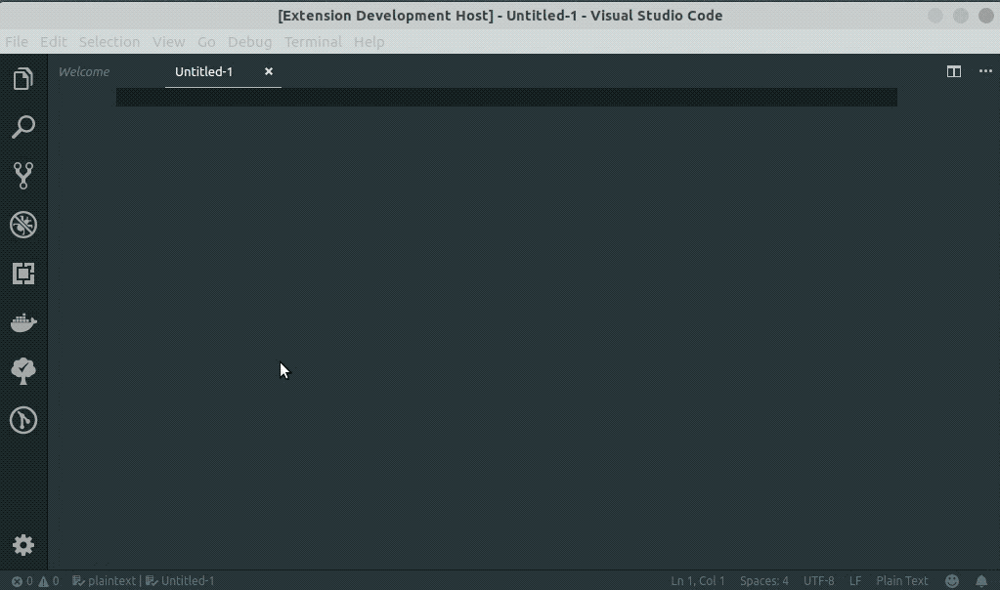

# graphql-to-rest-queries README

Convert GraphQL queries to REST API POST body query so you can using it directly in Postman or other REST clients.

## How to

- New file.
- Paste your GraphQL query.
- `CMD` + `Shift` + `P` to run Command Plate.
- Type GraphQL To Rest and click `Enter`.
- Copy/Paste into your favorite REST client or cURL.

## Features

This is an example of a GraphQL query from [Microsoft Graph Demo](https://github.com/microsoftgraph/graphql-demo) converting the GraphQL query to REST body and send it via Postman

## Release Notes

Initial release, feedback welcomed

### 0.1.0

Initial release of GraphQL to Rest query